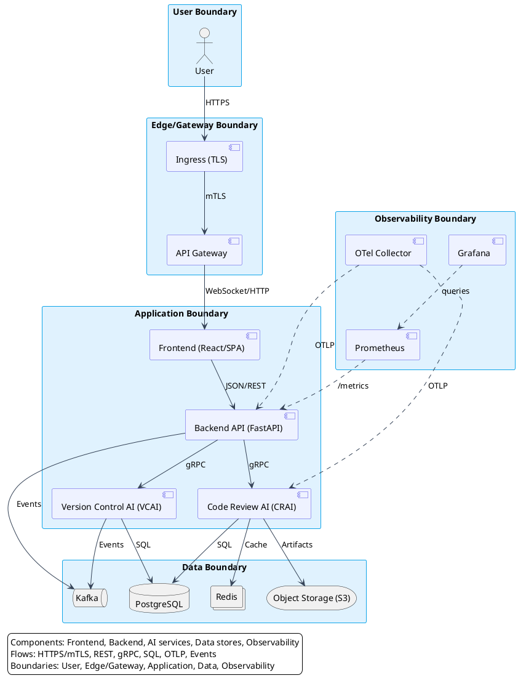
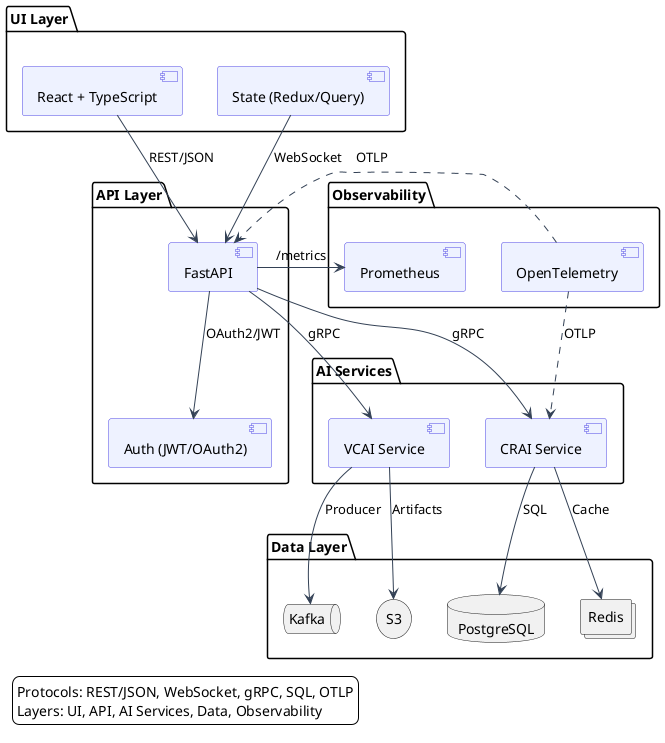
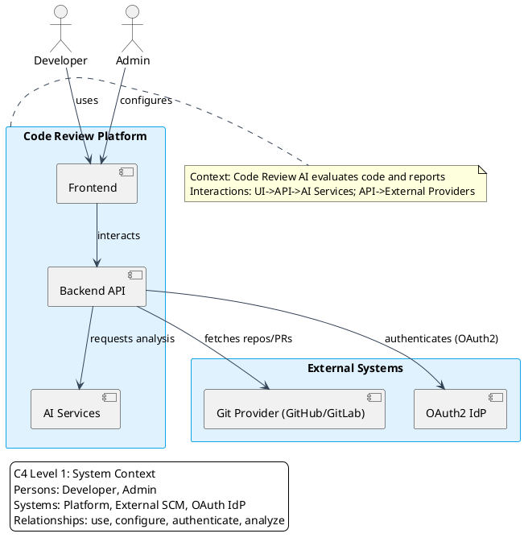
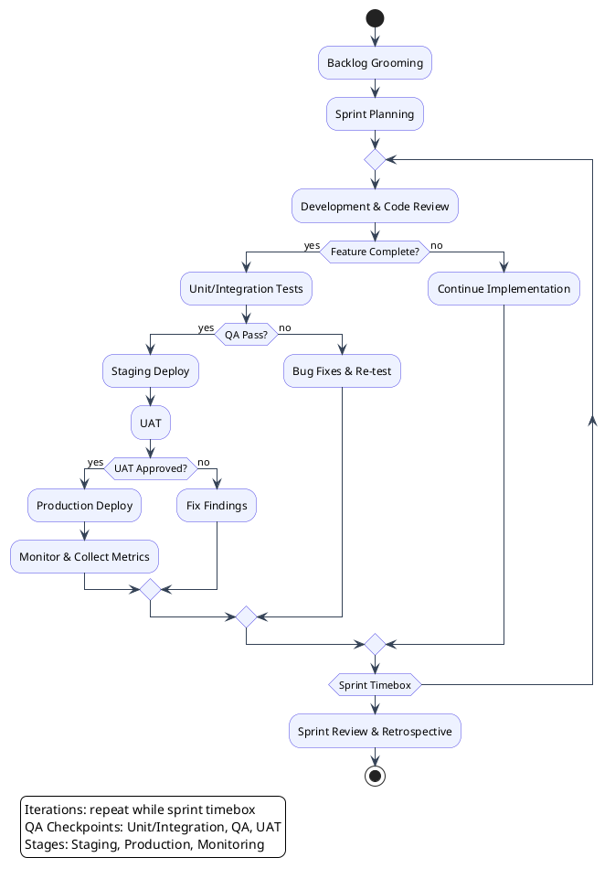
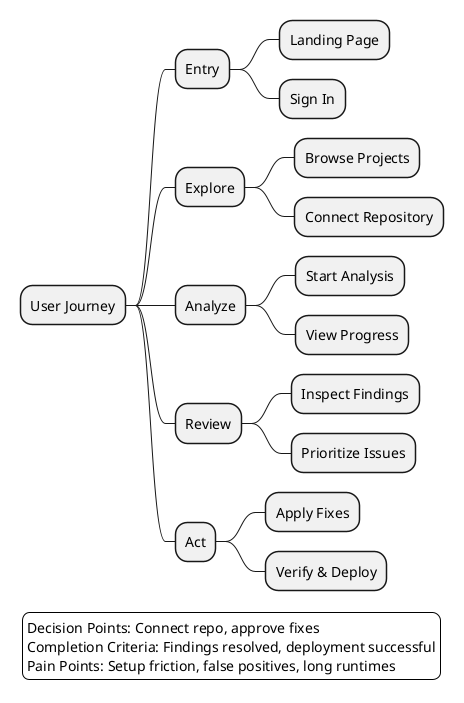

proposal

## Chapter 1 Conclusion: High-Level System Architecture

Alt-text: Overview of platform components, data flow, boundaries, and interactions.

This diagram references major subsystems (Frontend, Gateway, AI services, Data stores, Monitoring) and their data flows and boundaries.

## Chapter 3 Development Tools Section: Technical Stack Architecture

Alt-text: Stack layers with front-end integration, AI components, data layer, and protocols.

Referenced stack: UI, API, AI services, Data stores, and Observability tools.

## Chapter 6.4: C4 Level 1 System Context

Alt-text: System context showing primary actors, core system, and external dependencies.

System context references: User, Code Review Platform, External SCM/OAuth providers.

## Chapter 6.5: Agile Development Flowchart

Alt-text: Flowchart of iterative sprints, QA gates, and deployment stages.

This flowchart references sprint planning, development, QA, and deployment.

## Chapter 6.6: Functional Interface Schematics

Alt-text: UI layout, navigation, interactions, and state transitions.

Schematics reference: Dashboard, Project Detail, Analysis Report, Settings.

```plantuml
@startuml
skinparam backgroundColor #FFFFFF
skinparam defaultFontName Calibri
skinparam ArrowColor #334155

salt
{
  "Dashboard"
  [Projects] [Analyses] [Settings]
}

salt
{
  "Project Detail"
  [Repo Info] [Open PRs] [Run Analysis]
}

salt
{
  "Analysis Report"
  [Issues List] [Summary] [Export]
}

salt
{
  "Settings"
  [Providers] [API Keys] [Roles]
}

"Dashboard" --> "Project Detail" : Navigate to project
"Project Detail" --> "Analysis Report" : View results
"Settings" --> "Providers" : Configure integrations

legend left
  UI Components: Dashboard, Project, Report, Settings
  Navigation: Dashboard -> Project -> Report
  Interactions: Run analysis, export, configure
endlegend
@enduml
```

## Chapter 6.7: User Journey Map

Alt-text: Journey from entry to completion with decision and pain points.

Referenced journey: Entry -> Explore -> Analyze -> Review -> Act.

